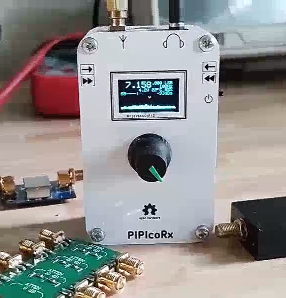
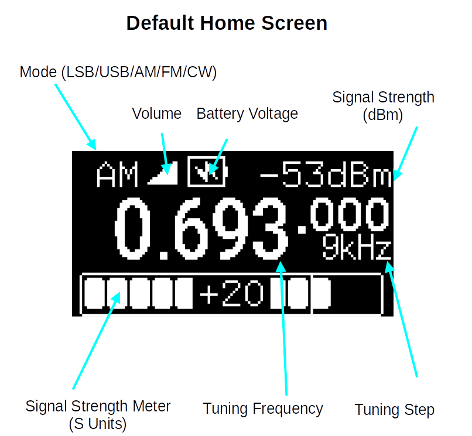
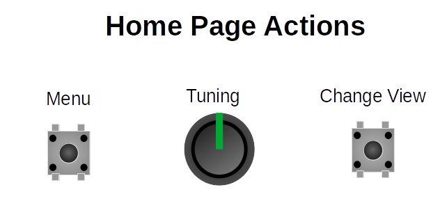
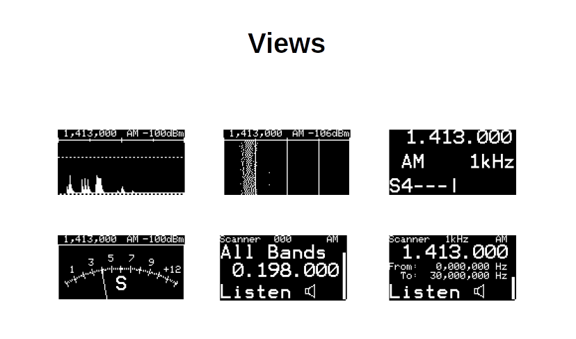
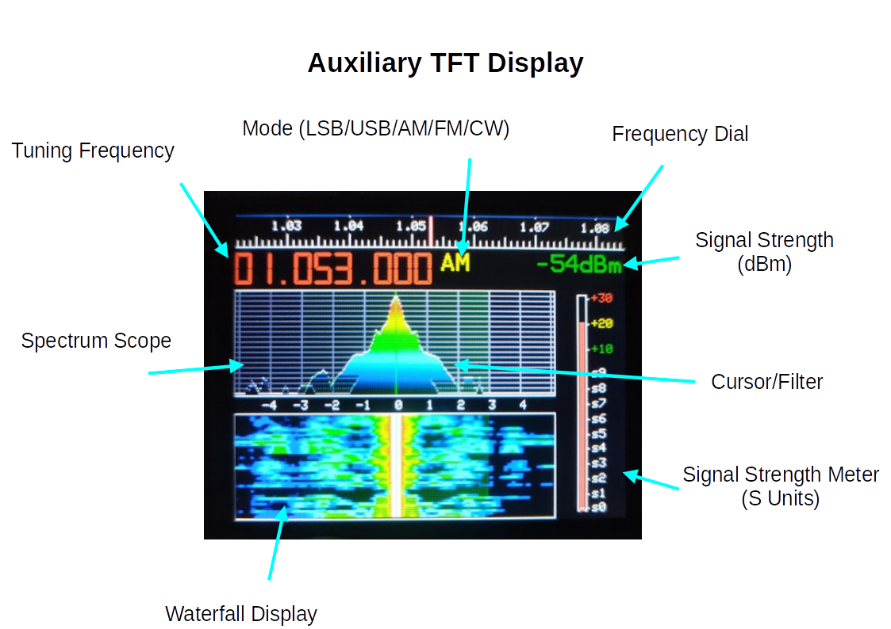
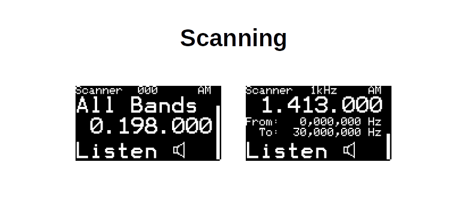
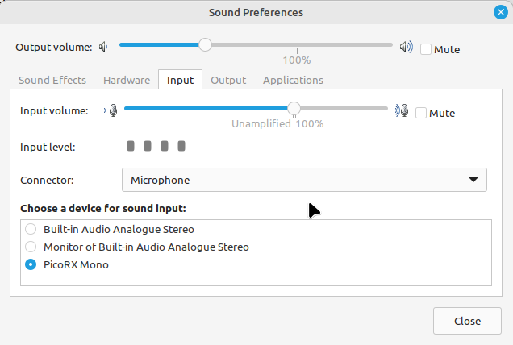

.. header::
  Pi Pico Rx User Manual

.. footer::
  Revision 2 Copyright (C) Jonathan P Dawson 2025

  Page ###Page### of ###Total###

Pi Pico RX - User Manual
########################

.. raw:: pdf

   PageBreak

.. sectnum::

.. contents::

.. raw:: pdf

   PageBreak

Home Screen
===================

Views
------

Views include spectrum scope, waterfall, status info, memory scan, frequency scan etc.

Tuning
------

+-------------------------------------------+----------------------------------------+
| Shortcut                                  |          Description                   |
+===========================================+========================================+
| Encoder Rotate                            |        Tuning Up/Down                  |
+-------------------------------------------+----------------------------------------+
| Encoder Rotate + Menu held                |      Tuning Up/Down x10                |
+-------------------------------------------+----------------------------------------+
| Encoder Rotate + Back held                |      Tuning Up/Down /10                |
+-------------------------------------------+----------------------------------------+
| Encoder Rotate + Menu held + Back held    |      Tuning Up/Down x100               |
+-------------------------------------------+----------------------------------------+

Shortcuts
---------

+-------------------------------------------+----------------------------------------+
| Shortcut                                  |          Description                   |
+===========================================+========================================+
| Encoder Rotate                            |        Tuning Up/Down                  |
+-------------------------------------------+----------------------------------------+
| Encoder Rotate + Menu held                |      Tuning Up/Down x10                |
+-------------------------------------------+----------------------------------------+
| Encoder Rotate + Menu held + Back held    |      Tuning Up/Down /10                |
+-------------------------------------------+----------------------------------------+
| Encoder Rotate + Menu held + Back held    |      Tuning Up/Down x100               |
+-------------------------------------------+----------------------------------------+
| Encoder Rotate + Encoder Held             |        Volume Up/Down                  |
+-------------------------------------------+----------------------------------------+
| Encoder Rotate + Encoder Held + Menu Held | Mode Select (AM/AMS/FM/CW/LSB/USB)     |
+-------------------------------------------+----------------------------------------+
| Encoder Rotate + Encoder Held + Back Held |         Squelch Up/Down                |
+-------------------------------------------+----------------------------------------+

.. raw:: pdf

   PageBreak

Auxiliary TFT Display (Optional)
================================

Main Menu
=========

Radio functions and configuration are accessed through the main menu.

+------------------+--------------------------+--------------------------------------------------------------------------------------------------------------------+
| Setting          | Range                    | Description                                                                                                        |
+==================+==========================+====================================================================================================================+
| Frequency        | 0-30 MHz                 | Manual Frequency Entry. Selecting a frequency outside the current band will reset the band limits to               |
|                  |                          | allow free-tuning across the full frequency range.                                                                 |
+------------------+--------------------------+--------------------------------------------------------------------------------------------------------------------+
| Memory Recall    | 0-511                    | Select One of 512 memory channels (A channel can be a single frequency or a band of interest)                      |
+------------------+--------------------------+--------------------------------------------------------------------------------------------------------------------+
| Memory Store     | 0-511                    | Save the current frequency, mode etc. in one of 512 memory channels                                                |
+------------------+--------------------------+--------------------------------------------------------------------------------------------------------------------+
| Volume           | 0-9                      | Audio Volume 0=mute                                                                                                |
+------------------+--------------------------+--------------------------------------------------------------------------------------------------------------------+
| Mode             |                          | Receiver mode (AM, AMS, FM, LSB, USB, CW)                                                                          |
+------------------+--------------------------+--------------------------------------------------------------------------------------------------------------------+
| AGC              | Very Slow – Fast, Manual | Automatic gain control adjusts the gain so that weak and strong stations have a similar volume level.              |
|                  |                          | Fast settings respond quickly to changes in signal level, slow settings change more gradually.                     |
|                  |                          | A slow setting might prevent adjustments to gain during gaps in speech. Manual gain control is also                |
|                  |                          | possible, this might be useful when a constant gain is desirable, e.g. when working with digital modes.            |
+------------------+--------------------------+--------------------------------------------------------------------------------------------------------------------+
| AGC Gain         | 0dB to 60dB              | In Manual mode, this settings specifies the gain directly. In other modes, this setting specifies the              |
|                  |                          | maximum gain limit for the AGC.  Note: If you set a low gain value might prevent weak signals being                |
|                  |                          | heard, if the receiver seems deaf, check this setting!                                                             |
+------------------+--------------------------+--------------------------------------------------------------------------------------------------------------------+
| Bandwidth        | Very Narrow – Very Wide  | Adjust the filter bandwidth, a narrow setting reduces background noise and can improve intelligibility             |
|                  |                          | of weak signals. A wider settings allows through a greater range of frequencies giving better sound                |
|                  |                          | quality for strong signals.                                                                                        |
+------------------+--------------------------+--------------------------------------------------------------------------------------------------------------------+
| Squelch          | S0 - S9+30dB             | The squelch function gates background noise. The signal is muted unless the signal strength reaches                |
|                  |                          | a defined level. Squelch can be adjusted to allow signals to be audible when active, but remove                    |
|                  |                          | background noise when inactive.                                                                                    |
+------------------+--------------------------+--------------------------------------------------------------------------------------------------------------------+
| Squelch Timeout  | 50ms-5s                  | This setting specifies the timeout for the squelch function. When a signal falls below the squelch                 |
|                  |                          | threshold it will continue to be heard until the timeout expires.                                                  |
+------------------+--------------------------+--------------------------------------------------------------------------------------------------------------------+
| Noise Reduction  |                          | Noise Reduction Menu                                                                                               |
+------------------+--------------------------+--------------------------------------------------------------------------------------------------------------------+
| Auto Notch       | On/Off                   | The automatic notch filter can be used to remove interfering tones. If stable interference is detected             |
|                  |                          | consistently at the same frequency, a narrow notch is enabled to automatically suppress the interference.          |
+------------------+--------------------------+--------------------------------------------------------------------------------------------------------------------+
| De-Emphasis      | Off/50us/75us            | Enable de-emphasis filter                                                                                          |
+------------------+--------------------------+--------------------------------------------------------------------------------------------------------------------+
| Bass             | Off, 5-20dB              | Bass tone control                                                                                                  |
+------------------+--------------------------+--------------------------------------------------------------------------------------------------------------------+
| Treble           | Off, 5-20dB              | Treble tone control                                                                                                |
+------------------+--------------------------+--------------------------------------------------------------------------------------------------------------------+
| IQ-Correction    | On/Off                   | Compensates for differences in phase/magnitude in the IQ inputs. Enable this setting to improve image              |
|                  |                          | rejection (remove mirror frequencies)                                                                              |
+------------------+--------------------------+--------------------------------------------------------------------------------------------------------------------+
| Aux Display      | Waterfall/SSTV Decode    | Switch between views in auxiliary (TFT) display (if fitted)                                                        |
+------------------+--------------------------+--------------------------------------------------------------------------------------------------------------------+
| Spectrum         |                          | Spectrum Menu                                                                                                      |
+------------------+--------------------------+--------------------------------------------------------------------------------------------------------------------+
| Band Start/Stop  | 0-30MHz                  | The band-start and band-stop settings define the tuning range of the current band. The band-start and              |
|                  |                          | band stop settings are stored in memory channels allowing memory channels to hold bands as well as                 |
|                  |                          | individual frequencies.                                                                                            |
+------------------+--------------------------+--------------------------------------------------------------------------------------------------------------------+
| Frequency Step   | 10Hz-100kHz              | Set the default tuning step. Note that fast and slow tuning from /10 to \*100 the nominal frequency                |
|                  |                          | step can be achieved by holding the menu/back buttons.                                                             |
+------------------+--------------------------+--------------------------------------------------------------------------------------------------------------------+
| CW Tone          | 100Hz - 3000Hz           | When received, the CW signal has a very narrow bandwidth close to DC, lower than the range of human hearing.       |
|                  |                          | The CW tone increases the frequency of the CW signal to a frequency that can be heard comfortably A frequency      |
|                  |                          | between 500Hz and 1000Hz is typical.                                                                               |
+------------------+--------------------------+--------------------------------------------------------------------------------------------------------------------+
| USB Stream       | Audio/IQ                 | Two USB streaming modes are supported. In audio mode, the device is configured as a mono USB                       |
|                  |                          | microphone. In this mode, the demodulated audio is streamed via USB, e.g. for sound recording or for               |
|                  |                          | use with digi-mode apps such as fldigi or wsjtx. In IQ mode, raw IQ data is streamed via USB as a                  |
|                  |                          | stereo stream. In this mode the device can be used with SDR software such as quisk or gqrx.                        |
+------------------+--------------------------+--------------------------------------------------------------------------------------------------------------------+
| HW Configuration |                          | The Pi Pico RX is designed to be as flexible as possible to allow different configurations and                     |
|                  |                          | experimentation by constructors. A separate hardware configuration menu is provided to configure the hardware.     |
+------------------+--------------------------+--------------------------------------------------------------------------------------------------------------------+

Spectrum Menu
=============

+------------------+--------------------------+--------------------------------------------------------------------------------------------------------------------+
| Setting          | Range                    | Description                                                                                                        |
+==================+==========================+====================================================================================================================+
| Spectrum Zoom    | 1-4                      | Zoom level for spectrum scope. 1=30kHz, 2=15kHz, 3=7.5kHz, 4=3.75kHz                                               |
+------------------+--------------------------+--------------------------------------------------------------------------------------------------------------------+
| Spectrum         | 1-4                      | Time Domain Smoothing (averaging) 1=least smoothing 4 = most smoothing                                             |
| Smoothing        |                          |                                                                                                                    |
+------------------+--------------------------+--------------------------------------------------------------------------------------------------------------------+

Noise Reduction
===============

+------------------+---------------------------+--------------------------------------------------------------------------------------------------------------------+
| Setting          | Range                     | Description                                                                                                        |
+==================+===========================+====================================================================================================================+
| Enable           | 1-4                       | Zoom level for spectrum scope. 1=30kHz, 2=15kHz, 3=7.5kHz, 4=3.75kHz                                               |
+------------------+---------------------------+--------------------------------------------------------------------------------------------------------------------+
| Noise            | Very Fast - Very Slow     | Timescale for noise estimation. A fast setting allows the algorithms to adapt to fast changes in noise level.      |
| Estimation       |                           | A slow setting gives a more stable noise measurement.                                                              |
+------------------+---------------------------+--------------------------------------------------------------------------------------------------------------------+
| Noise            | Adaptive, Low - Very High | A high setting removes more noise, but may also remove some signal. The adaptive setting removes more noise when   |
| Threshold        |                           | and uses a less agressive setting in low-noise environments.                                                       |
+------------------+---------------------------+--------------------------------------------------------------------------------------------------------------------+

Hardware Configuration Menu
===========================

+--------------------+-------------------------------+------------------------------------------------------------------------------------------------------------+
| Setting            | Range                         |  Description                                                                                               |
+--------------------+-------------------------------+------------------------------------------------------------------------------------------------------------+
| Display Timeout    | Never, 5 seconds – 4 minutes  |  Display turns off after a period of inactivity. This can be useful for power saving when running from     |
|                    |                               |  batteries. This may also help prevent noise being generated by the display being received.                |
+--------------------+-------------------------------+------------------------------------------------------------------------------------------------------------+
| Regulator Mode     | FM/PWM                        |  The Pi Pico contains a switched-mode regulator. Under light loading, the regulator can switch into a FM   |
|                    |                               |  mode to save power, this does however increase supply ripple. The PWM setting reduces supply ripple.      |
+--------------------+-------------------------------+------------------------------------------------------------------------------------------------------------+
| Reverse Encoder    | On/Off                        |  This allows the direction of the encoder to be reversed (clockwise/anticlockwise). This allows for        |
|                    |                               |  variations in hardware construction where the encoder is wired in a different configuration.              |
+--------------------+-------------------------------+------------------------------------------------------------------------------------------------------------+ 
| Encoder Resolution | On/Off                        |  Allows higher resolution rotary encoders to be used.                                                      |
+--------------------+-------------------------------+------------------------------------------------------------------------------------------------------------+
| Swap IQ            | On/Off                        |  Swap the I/Q ADC input channels. Can be used to correct for a difference in wiring of the LO inputs,      |
|                    |                               |  or IQ inputs. It causes the received spectrum to be reversed so that positive frequencies become negative |
|                    |                               |  and vice-versa. This is also useful for checking image rejection.                                         |
+--------------------+-------------------------------+------------------------------------------------------------------------------------------------------------+
| Gain Cal           | 1-100dB                       |  Specifies the gain of the receiver, this is used by the software to calculate the signal strength for the |
|                    |                               |  S-meter and dBm signal strength. The breadboard version of the receiver with default components has a     |
|                    |                               |  gain of 57dB. Constructors may use alternative gain values, additional filters or preamplifiers. This     |
|                    |                               |  setting also allows the S-meter to be calibrated so that it reads the correct signal strength with a      |
|                    |                               |  known input signal.                                                                                       |
+--------------------+-------------------------------+------------------------------------------------------------------------------------------------------------+
| Freq Cal           | -100 to +100 ppm              |  Allows oscillator frequency to be calibrated to account for process variations in the pi-pico crystal     |
|                    |                               |  oscillator. Frequency can be tuned using a reference oscillator or frequency counter. It may also be      |
|                    |                               |  possible to calibrate by “zero-beating” a station with a known carrier frequency e.g. a broadcast AM      |
|                    |                               |  staio or a reference station such as WWV.                                                                 |
|                    |                               |                                                                                                            |
|                    |                               |  The reciever included a frequency measurement facility, that measures the difference between the recieved |
|                    |                               |  carrier and the tuned frequency. The frequency measurement process takes around 2 seconds. Indicator      |
|                    |                               |  arrows `<` and `>` indicate whether the PPM setting needs to be increased or decreased.                   |
+--------------------+-------------------------------+------------------------------------------------------------------------------------------------------------+
| Flip OLED          | On/Off                        |  Allows the display to be flipped horizontally, this may be useful to constructors who need to place the   |
|                    |                               |  display in a different orientation. Only landscape orientations are supported.                            |
+--------------------+-------------------------------+------------------------------------------------------------------------------------------------------------+
| OLED Type          | SSD1306/SH1106                |  Allows different types of OLED display to be used. I2C OLED displays using SD1306 and SH1106 driver chips |
|                    |                               |  are supported.                                                                                            |
+--------------------+-------------------------------+------------------------------------------------------------------------------------------------------------+
| Display Contrast   | 0 to 15                       |  Allows contrast of OLED display to be adjusted. Lower values reduce power consumption, higher values      |
|                    |                               |  improve readability in bright surroundings.                                                               |
+--------------------+-------------------------------+------------------------------------------------------------------------------------------------------------+
| TFT Settings       | Off, Rotation 1-8.            |  An optional SPI TFT (ili9341) display can be connected to provide an enhanced waterfall/spectrum scope.   |
|                    |                               |  By default the secondary TFT display is disabled. To allow for variations in hardware, 8 different        |
|                    |                               |  rotation settings are provided.                                                                           |
+--------------------+-------------------------------+------------------------------------------------------------------------------------------------------------+
| TFT Colour         | RGB/BGR                       |  Some displays swap RGB and BGR colour order. The seven-segment display should be red, if your's is blue   |
|                    |                               |  change this setting.                                                                                      |
+--------------------+-------------------------------+------------------------------------------------------------------------------------------------------------+
| TFT Invert         | Normal/Invert                 |  Some displays invert colours (like a negative). The background should be black, if your's is white change |
|                    |                               |  this setting.                                                                                             |
+--------------------+-------------------------------+------------------------------------------------------------------------------------------------------------+
| TFT Driver         | Normal/Alternate              |  Lots of variation exists between ILI9341 displays, two drivers are included you may get better results by |
|                    |                               |  trying an alternate driver.                                                                               |
+--------------------+-------------------------------+------------------------------------------------------------------------------------------------------------+
| Bands              | Band 1-5 0 to 32MHz           |  Pi Pico Rx provides 3 GPIO outputs to control up to 8 band filters. The default settings are intended to  |
|                    |                               |  work with the PCB version and provide a good compromise for a general coverage receiver. The boundary     |
|                    |                               |  between the bands can configured through this menu, this allows constructors to define their own custom   |
|                    |                               |  bands (e.g. one band-pass filter for each amateur radio band).                                            |
+--------------------+-------------------------------+------------------------------------------------------------------------------------------------------------+
| IF Mode            | Nearest, Lower, Upper         |  Pi Pico Rx uses a low IF, typically a few kHz from the tuned signal. This eliminates noise that occurs    |
|                    |                               |  close to the local oscillator frequency due to 1/F effects etc. By default, the NCO is tuned to the       |
|                    |                               |  closest achieveable frequency to the requested IF. The lower and upper mode force the NCO to be tuned     |
|                    |                               |  below or above the chosen frequency. Changing the IF mode may help eliminate interference.                |
+--------------------+-------------------------------+------------------------------------------------------------------------------------------------------------+
| IF Frequency       | 0-12kHz                       |  The IF frequency may be adjusted. This might be useful if you are experiencing interfering signals. It    |
|                    |                               |  is often possible to mitigate interference by changing the IF frequency, which will allow interfering     |
|                    |                               |  signals to be moved away from the tuned frequency under some circumstances.                               |
+--------------------+-------------------------------+------------------------------------------------------------------------------------------------------------+
| External NCO       | Off/On                        |  Enable (experimental) support for external SI5351 NCO. This mode is intended mainly for performance       |
|                    |                               |  evaluation purposes, an external NCO is not required to operate the Pi Pico Rx.                           |
+--------------------+-------------------------------+------------------------------------------------------------------------------------------------------------+
| USB Upload         |                               |  Places Pi Pico into USB firmware upload mode. The device appears as a USB drive, and can be upgraded by   |
|                    |                               |  dropping writing a .uf2 firmware image. This is equivalent to holding the pico push-button during power   |
|                    |                               |  on.                                                                                                       |
+--------------------+-------------------------------+------------------------------------------------------------------------------------------------------------+

Scanning
========

Pi Pico RX provides a scan feature, the scan feature can be accessed as a
separate “home screen view”. (Different views can be selected by pressing the
“back” button on the home screen.

There are 2 scanning modes, frequency scan and memory scan. In frequency scan
mode, the receiver searches for signals in the current band frequency range
(e.g. 20m SSB band). In memory scan mode, the receiver searches memory channels
for active signals.

The encoder controls both the direction and speed of the search.

In both modes, the squelch setting is used to determine the threshold level, if
the signal strength exceeds the squelch threshold, the search is halted.
Searching can be continued by rotating the encoder.

The current signal strength and squelch level are indicated by a vertical bar
on the right hand side.

CAT Control
===========

.. image:: images/cat_settings.png
  :width: 75%
  :align: center

Cat control is provided through a USB serial port interface. The Pi Pico Rx
emulates a subset Kenwood TS-480. The CAT interface allows the receiver to be
controlled via a host device by software such as grig, wsjtx and fldigi.

USB Audio
=========

The Pi Pico Rx supports USB audio, and when connected should appear as a USB
microphone. This allows a host device to easily make audio recordings (e.g.
using audacity), and is compatible with software such as wsjtx, fldigi and
QSSTV. When combined with USB cat control allows a fully functional PC
connection using only a single USB cable. The direct digital audio connection
provides superior audio quality compared to an analogue connection using a
sound card.
